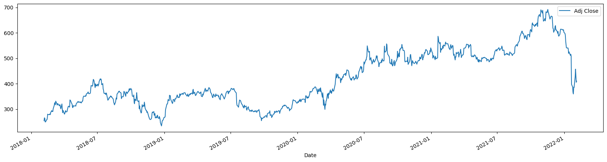
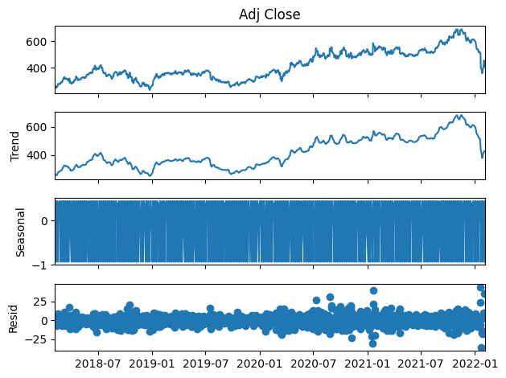
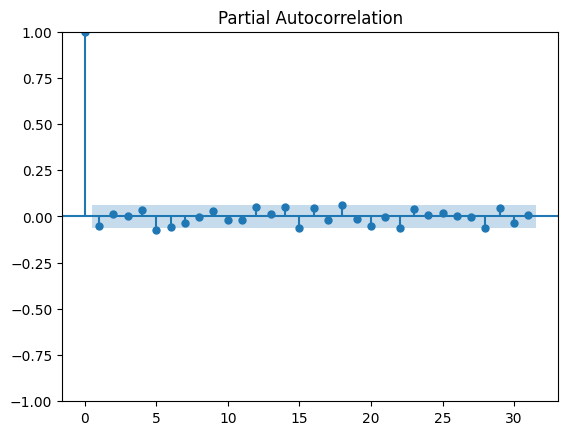
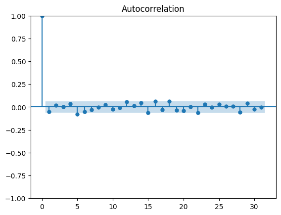
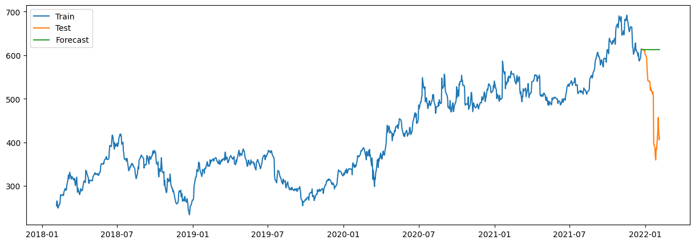

# Netflix Stock Price Forecasting Using ARIMA

## 📌 Project Overview

In this project, I used the **ARIMA time-series model** to forecast Netflix's adjusted closing stock price.

The main purpose of this project was to understand the complete time-series forecasting process, from checking stationarity to evaluating the final forecast.

## 🎯 Objectives

- Analyze Netflix stock-price data
- Check stationarity using the ADF test
- Apply differencing to make the series stationary
- Analyze ACF and PACF
- Compare different ARIMA models
- Forecast future stock prices
- Evaluate model performance

## 🛠️ Tools Used

- Python
- Pandas
- NumPy
- Matplotlib
- Seaborn
- Statsmodels
- Scikit-learn
- Google Colab

## 📊 Dataset

The dataset contains Netflix stock data from **2018 to 2022**.

It includes:

- Date
- Open
- High
- Low
- Close
- Adjusted Close
- Volume

For forecasting, I used **Adjusted Close** as the target variable.

## 🔍 Approach

### 1. Data Cleaning

I checked the dataset for missing values and duplicate records, converted the `Date` column to datetime format, and used it as the time-series index.

### 2. Data Visualization

I plotted the adjusted closing price to understand the overall trend and movement of Netflix's stock price.

### 3. Stationarity

The original series was **not stationary**, so I used the **Augmented Dickey-Fuller (ADF) test** to confirm this.

### 4. Differencing

I applied **first-order differencing** to remove the trend and make the series stationary.

The ADF test after differencing confirmed that the series had become stationary.

### 5. ACF and PACF

I used ACF and PACF plots to understand the autocorrelation of the differenced series and help determine suitable ARIMA parameters.

### 6. Model Comparison

I tested multiple ARIMA configurations and compared them using:

- MAE
- RMSE

The model with the lowest RMSE was selected as the final model.

## 📈 Visualizations

### Netflix Stock Price

### Seasonal Decomposition

### ACF and PACF

### Actual vs Forecast

## 📊 Results

The final model achieved approximately:

| Metric | Result |
|---|---:|
| MAE | 109.35 |
| RMSE | 139.08 |

The model captured some patterns in the historical data, but the forecast was not accurate enough for reliable real-world stock-price prediction.

## 📝 Conclusion

ARIMA is useful for understanding and practicing time-series forecasting. However, stock prices are influenced by many external factors that are not included in this model.

For future improvement, I could use **SARIMAX or Machine Learning models** and include additional features such as trading volume and market indicators.

## ⚠️ Limitations

- Only historical adjusted closing prices were used.
- External market factors were not included.
- Stock prices can be highly volatile.
- The project is intended for learning and demonstrating time-series forecasting rather than investment advice.

## 📓 Project Notebook

[Open the Jupyter Notebook](netflix_stock_forecasting_arima.ipynb)

## 🚀 Google Colab

[Open the project in Google Colab](https://colab.research.google.com/drive/1meueJwsfSA9hg5OS8NgNOey68MlLVhD5#scrollTo=NKrLxu-DKeOU))

## 👨‍💻 Author

**Shaheen Khan**
